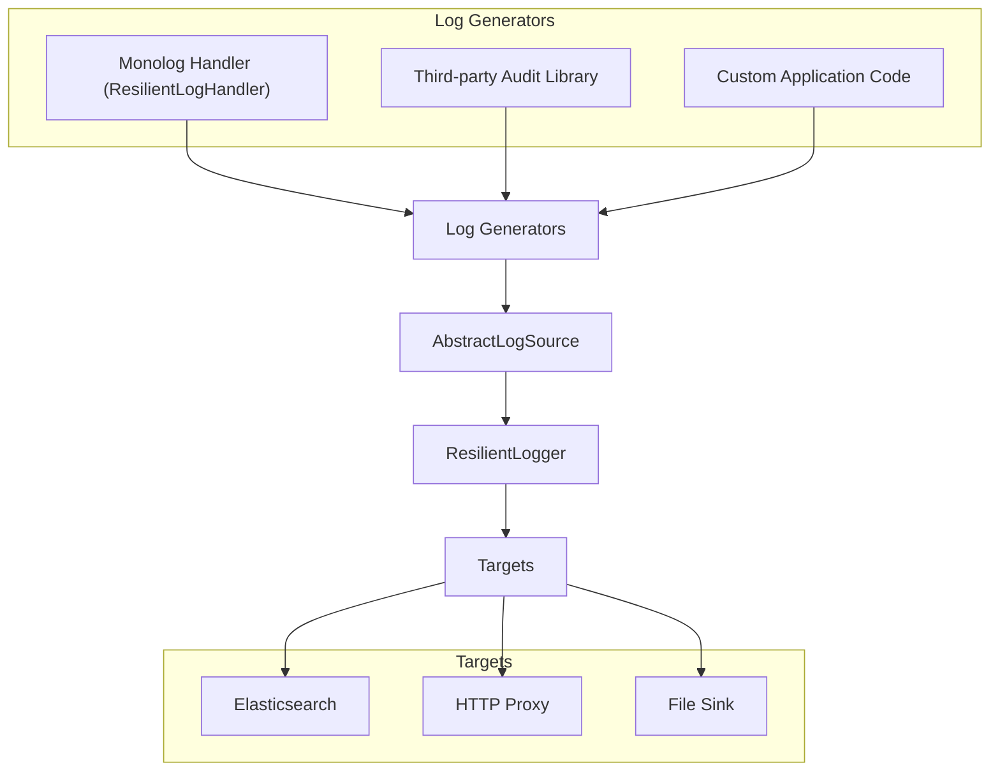

# PHP Resilient Logger

A lightweight PHP library for **resilient, fault-tolerant log collection and delivery**.

Developed by the City of Helsinki as a **building block** for audit and other critical logging systems.

This library provides the **core abstractions** for collecting, storing, and delivering logs.

It is **not a logger itself** — concrete integrations, such as the [Drupal Resilient Logger Module](https://github.com/City-of-Helsinki/drupal-module-helfi-resilient-logger), build on top of it.

---

## Overview

`ResilientLogger` coordinates two types of components:

* **Sources (`AbstractLogSource`)**

  Represent stored log entries and define how entries are created, tracked, and retrieved before delivery.

  Entries can come from:

  * **Developer logging** via the Monolog handler (`ResilientLogHandler`)
  * **Third-party audit log libraries**
  * **Custom application code**

* **Targets (`AbstractLogTarget`)**

  Define how log entries are delivered to external systems (e.g., Elasticsearch, HTTP proxy, file sink).

* **Processing (`ResilientLogger`)**

  1. Reads unsent entries from configured sources.
  2. Passes entries to one or more targets.
  3. Marks entries as sent if delivery succeeds.
  4. Optionally cleans up old entries.

This ensures **logs are never lost**: if delivery fails, entries remain in storage until a future run succeeds.

---

## Workflow



* Logs can originate from **any source** implementing `AbstractLogSource`.
* `ResilientLogger` orchestrates delivery to one or more targets.
* Entries remain stored until successfully delivered (or cleared).

---

## Installation

```bash
composer require city-of-helsinki/php-resilient-logger
```

---

## Usage

### 1. Instantiate `ResilientLogger`

The main class is **instantiated via the `create()` method**, which handles validation and configuration of sources and targets.

```php
use ResilientLogger\ResilientLogger;
use App\Sources\MyLogSource;
use App\Targets\MyLogTarget;
use App\Targets\ElasticsearchLogTarget;

$options = [
    'sources' => [
        ['class' => MyLogSource::class],
    ],
    'targets' => [
        [
            'class' => MyLogTarget::class,
            'opt_name' => 'opt_value',
            'required' => false
        ],
        [
            'class' => ElasticsearchLogTarget::class,
            'es_url' => getenv('AUDIT_LOG_ES_URL') ?: 'http://example.test:9200',
            'es_username' => getenv('AUDIT_LOG_ES_USERNAME') ?: 'username',
            'es_password' => getenv('AUDIT_LOG_ES_PASSWORD') ?: 'password',
            'es_index' => getenv('AUDIT_LOG_ES_INDEX') ?: 'index-name',
            'required' => true
        ],
    ],
    'environment' => getenv('AUDIT_LOG_ENV') ?: 'dev',
    'origin' => getenv('AUDIT_LOG_ORIGIN') ?: 'my-app',
    'batch_limit' => 5000,
    'chunk_size' => 500,
    'store_old_entries_days' => 30,
];

$logger = ResilientLogger::create($options);
```

> **Environment variables:** The environment variable names shown below are the standard names used by the infrastructure configuration for this library. Unless your environment specifically requires different names, use these names as-is.
>
> **Elasticsearch:**
>
> * `AUDIT_LOG_ES_URL`
> * `AUDIT_LOG_ES_USERNAME`
> * `AUDIT_LOG_ES_PASSWORD`
> * `AUDIT_LOG_ES_INDEX`
>
> **General Resilient Logger configuration:**
>
> * `AUDIT_LOG_ENV` — environment identifier, e.g. `dev`, `test`, or `prod`
> * `AUDIT_LOG_ORIGIN` — identifies the application or system producing the logs

### 2. Generate log entries

* **Monolog developer handler**:

```php
use Monolog\Logger;
use ResilientLogger\Handler\ResilientLogHandler;
use App\Sources\MyLogSource;

$loggerMonolog = new Logger('app');

$loggerMonolog->pushHandler(new ResilientLogHandler(MyLogSource::class, [
    'required_field_1',
    'required_field_2',
]));

$loggerMonolog->info('User logged in', ['user_id' => 42]);
```

* **Other sources**: third-party audit libraries or custom application code can also generate `AbstractLogSource` entries.

### 3. Process unsent entries

```php
// Submit unsent entries to all targets
$results = $logger->submitUnsentEntries();

// Optionally clear old sent entries
$logger->clearSentEntries();
```

* `submitUnsentEntries()` respects the `batch_limit` and target `required` flags.
* Entries that fail to deliver remain unsent for future retries.

---

## Example Target: Elasticsearch

A working Elasticsearch target implementation is provided:

[`ElasticsearchLogTarget`](./src/Targets/ElasticsearchLogTarget.php)

### Configuration

The Elasticsearch endpoint can be configured using either a complete URL or separate endpoint components:

| Option        | Description                                                               |
| ------------- | ------------------------------------------------------------------------- |
| `es_url`      | Elasticsearch endpoint URL, e.g. `https://elasticsearch.example.com:9200` |
| `es_scheme`   | URL scheme, e.g. `https`                                                  |
| `es_host`     | Elasticsearch hostname                                                    |
| `es_port`     | Elasticsearch port                                                        |
| `es_username` | Elasticsearch username                                                    |
| `es_password` | Elasticsearch password                                                    |
| `es_index`    | Elasticsearch index                                                       |

`es_scheme`, `es_host`, and `es_port` can be used to adjust the endpoint specified by `es_url`. If `es_url` does not include a scheme, `es_scheme` is used to construct it.

For example, the endpoint can be specified as a complete URL:

```php
[
    'class' => ElasticsearchLogTarget::class,
    'es_url' => 'https://elasticsearch.example.com:9200',
    'es_username' => 'username',
    'es_password' => 'password',
    'es_index' => 'my-index',
]
```

Or using separate endpoint components:

```php
[
    'class' => ElasticsearchLogTarget::class,
    'es_scheme' => 'https',
    'es_host' => 'elasticsearch.example.com',
    'es_port' => 9200,
    'es_username' => 'username',
    'es_password' => 'password',
    'es_index' => 'my-index',
]
```

Use `ElasticsearchLogTarget` as a reference when implementing custom targets.

---

## Who Should Use This?

* Developers building **audit logging pipelines** into larger systems.
* Framework or CMS integrations requiring **durable, fault-tolerant log delivery**.
* Not intended for simple scripts — entries must implement `AbstractLogSource`.

---

## Related Projects

* [Drupal Resilient Logger Module](https://github.com/City-of-Helsinki/drupal-module-helfi-resilient-logger) — wraps this library for Drupal and provides cron integration.

---

## License

MIT (or as defined in `composer.json`)

---

**Summary**:

* Extend **`AbstractLogSource`** to store and manage log entries.
* Use **`ResilientLogHandler`** or other producers to generate entries.
* Extend **`AbstractLogTarget`** to deliver them.
* Let `ResilientLogger` handle processing, retries, and cleanup.
